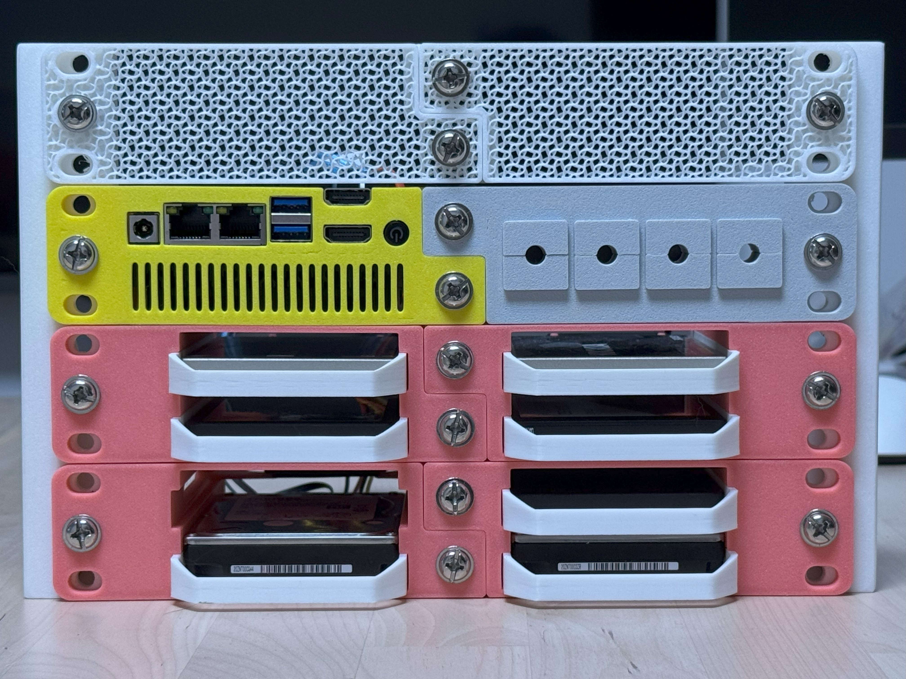
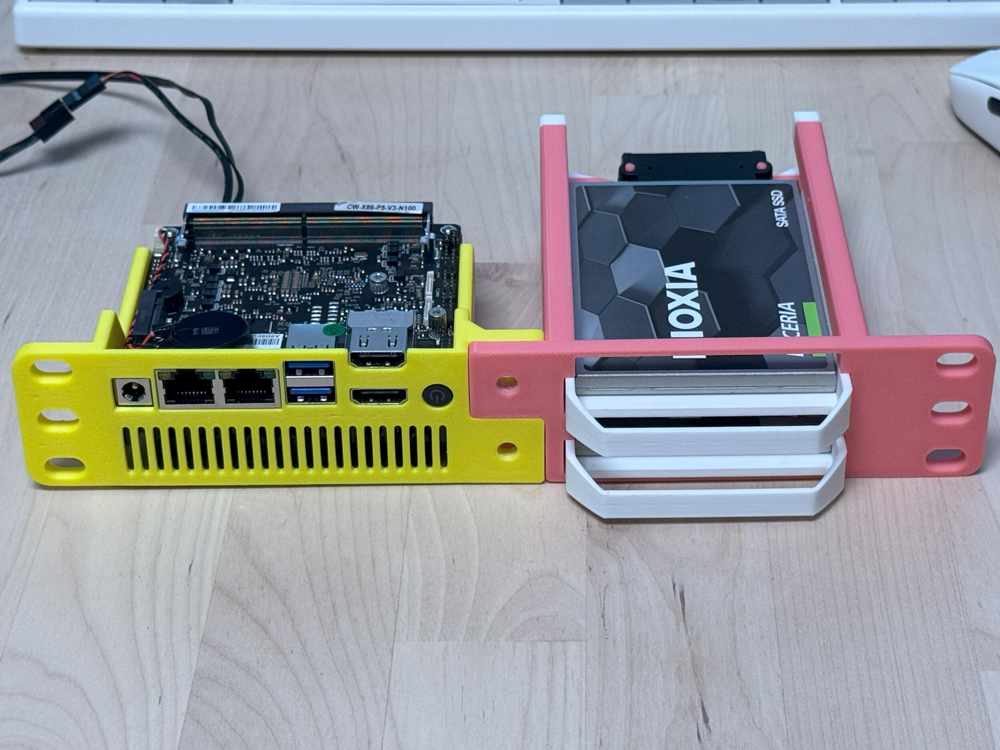
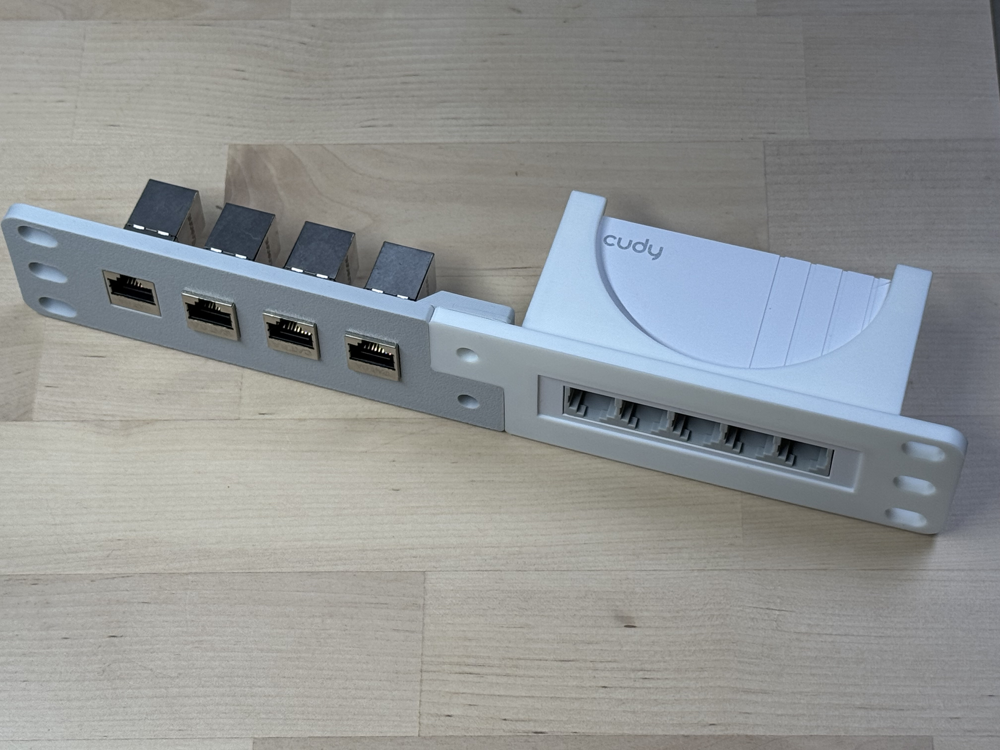
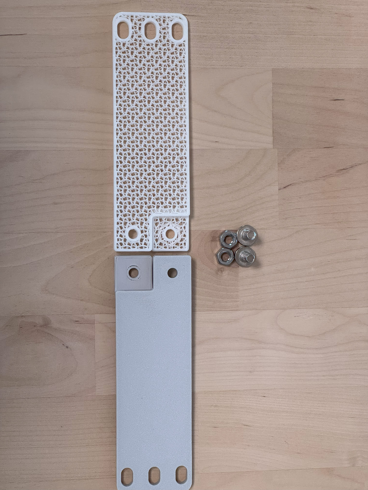
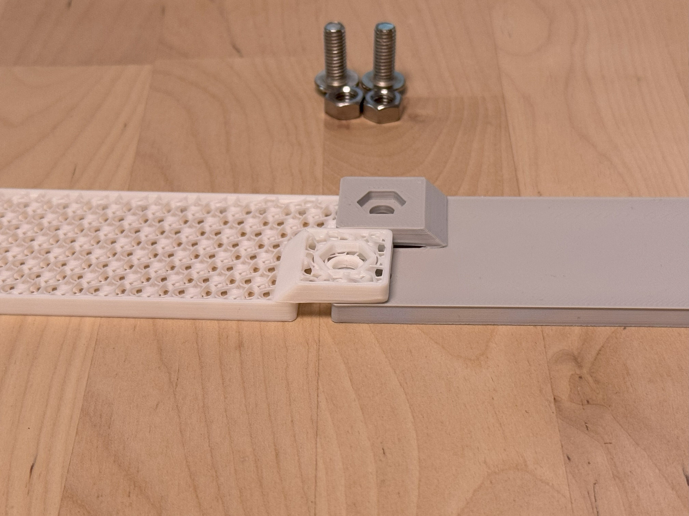
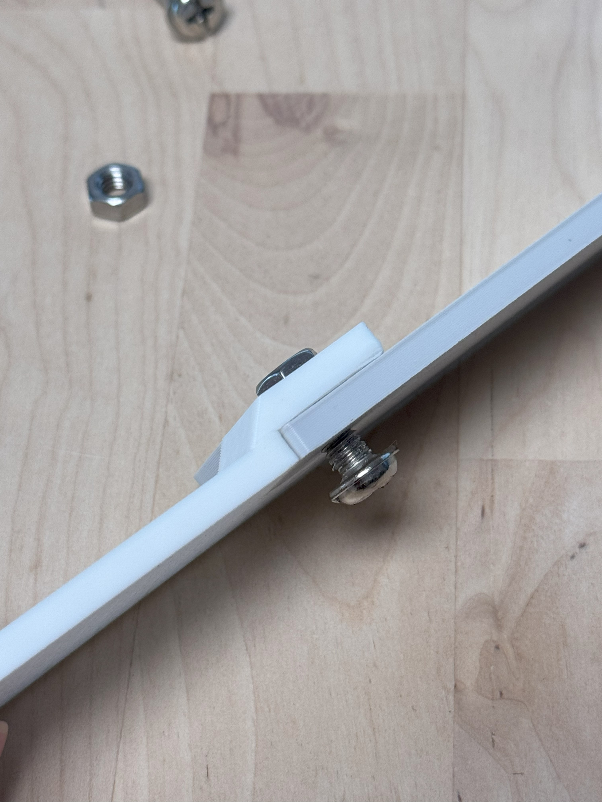
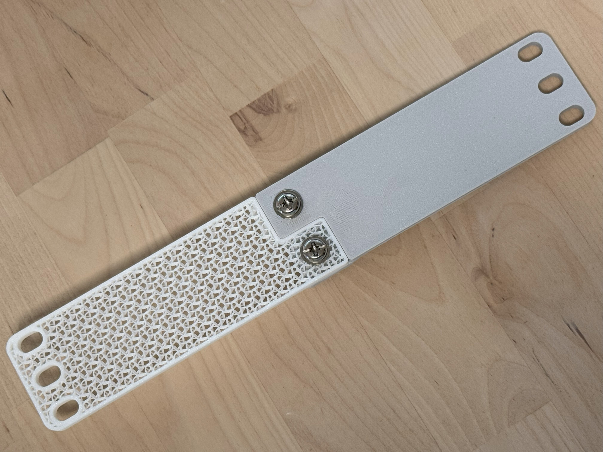

# 💊 CapRack

**The modular mounting system that transforms your 10-inch rack into a clean, aesthetic workspace.**

CapRack allows you to install small footprint equipment—like Raspberry Pis, mini PCs, and hard drives—into a standard 10-inch mini rack with a professional finish. No more messy trays or loose cables.

---

## 🧐 Why CapRack?

The 10-inch rack is a favorite among homelabbers for its compact footprint. However, there are few off-the-shelf devices designed for this niche standard. Enthusiasts often struggle to mount their smaller devices neatly, usually resorting to placing them loosely on shelves.

**CapRack solves this by breaking the 1U space into two 0.5U composable modules.**

- **Modular & Composable:** Mix and match any two modules to create a full 1U unit perfectly tailored to your needs.
- **Aesthetic:** Everything aligns perfectly. Hide the mess and show off your lab.
- **Standardized:** Uses common M6 screws for a secure and accessible connection.
- **3D Printable:** Designed to be printed easily on standard hobbyist printers.

## 🧩 Examples

The beauty of CapRack is flexibility and composability. Here are a few ways you can use it:

### The "Mini NAS"

Combine a **Mini PC Module** + **2.5-inch HDD Module**.

_Perfect for a compact TrueNAS or Unraid server._

### The "Edge Cluster"

Combine **2x Raspberry Pi Modules**.
_Repeat for as many units as you need. Ideal for K3s clusters or distributed computing labs._

### The "Custom Router"

Combine a **Mini PC Module** + **Keystone/Switch Module**.
_Build a powerful OPNsense/PfSense router with front-facing ports._

_A mini switch and patch panel._

---

## 📦 Module Catalog

Download and print these modules directly:

### Compute

- [**Raspberry Pi 4 / 5 Mount**](https://makerworld.com/zh/models/1769785-raspberry-pi-4-5-mount-modular-and-composable)
- [**CWWK x86-P5 Motherboard Mount**](https://makerworld.com/zh/models/1876206-cwwk-x86-p5-rack-mount-modular-composable) - For N100 boards, supports active cooling.

### Storage

- [**2.5-inch HDD/SSD Mount**](https://makerworld.com/zh/models/1757195-2-5-inch-disk-mount-modular-and-composable) - Hot-swappable design.

### Networking & Accessories

- [**Patch Panel Module**](https://makerworld.com/zh/models/2026534-patch-panel-module-composable-0-5u) - For keystone jacks.
- [**Blank / Vent Panels**](https://makerworld.com/zh/models/1757048-blank-panel-for-caprack-10-inch-rack-system) - To fill empty slots or improve airflow.
- [**Cudy GS105U Mount**](https://makerworld.com/zh/models/2060363-cudy-gs105u-mount-module-composable-0-5u) - [Cudy GS105U](https://www.cudy.com/products/gs105u-1-0) is a 5-port gigabit mini switch.

### 🚧 Work in Progress

- 3.5-inch HDD Mount (Fixed mount due to space constraints)
- Cable Management Module

---

## 🛠️ Assembly Guide

CapRack uses a standardized connection interface using **M6 screws**, commonly found in server environments.

**Requirements (per 1U unit):**

- 2x CapRack Modules
- 2x M6 Screws (12mm+ length)
- 2x M6 Hex Nuts

### Step-by-Step Connection

1. **Prepare parts**
   Align your two chosen modules.
   

2. **Slide together**
   Engage the dovetail/slot mechanism by sliding the modules from the side.
   

3. **Insert nuts**
   Slide until flush. Place an M6 hex nut into the designated captive slot on the rear.
   

4. **Secure**
   Insert the M6 screw from the front/side and tighten into the nut.
   

5. **Finish**
   Repeat for the second screw. Your rock-solid 1U unit is now ready to rack!
   

---

## 📐 Design Your Own Module

The design file for the blank panel is open source and available as a reference design. We encourage the community to create custom modules for their specific hardware needs.

**Reference design:** [Download blank panel step file](https://github.com/fenprace/CapRack/blob/master/steps/caprack_blank.STEP)

---

## 📚 Resources & Inspiration

- https://mini-rack.jeffgeerling.com
- https://github.com/Coole-Guus/pi-slice-rack
- https://www.amazon.com/GeeekPi-Raspberry-Adapters-Compatible-RackMate
